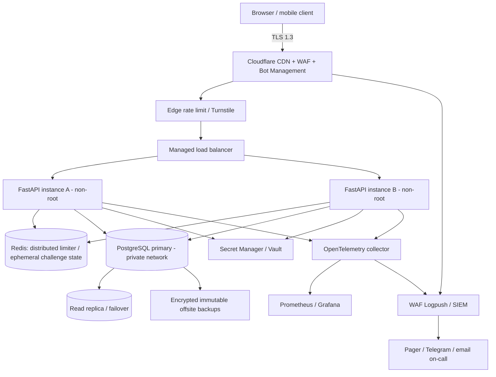
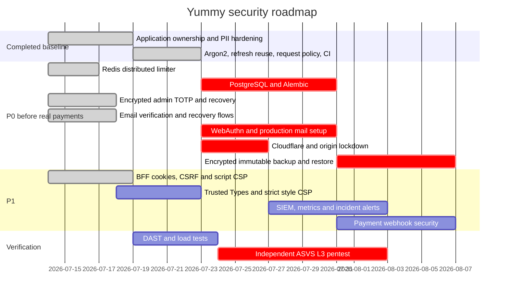

# Yummy — технический план security hardening

**Baseline:** 2026-07-14

**Текущий стек:** FastAPI, SQLite, vanilla JS, Render/GitHub Pages

**Целевой уровень:** архитектура, допускающая проверку по OWASP ASVS Level 3.
Это не заявление о compliance: статус L3 появляется только после evidence review
по каждому требованию и независимого тестирования.

## 1. Scope и решения

Максимальная безопасность не означает добавить все технологии из списка. Контроль
включается, если он закрывает реальную поверхность атаки:

- XML, LDAP, GraphQL, gRPC и file upload сейчас отсутствуют — соответствующие
  проверки **N/A**, а не фиктивно «реализованы».
- OAuth/OIDC нужен только при выборе внешнего identity provider.
- Production browser использует same-origin HttpOnly cookie session и
  double-submit CSRF. Bearer API остаётся отдельным cookie-independent контуром.
- 1000 RPS, HA 99.9%, PITR и horizontal scaling несовместимы с single-instance
  SQLite. Для этих NFR целевой data plane — PostgreSQL + Redis.
- TLS, L3/L4 DDoS, WAF, private network, disk encryption и SIEM подтверждаются
  конфигурацией провайдера и evidence, а не Python-кодом.

## 2. Требования и acceptance criteria

### Functional

| ID | Requirement | Acceptance criteria | Status |
|---|---|---|---|
| FR-01 | Регистрация/вход/выход/profile | negative auth tests, revoke-all, privacy export/delete | Implemented |
| FR-02 | MFA/WebAuthn | admin control plane requires MFA claim | TOTP/recovery done; WebAuthn P0 gap |
| FR-03 | RBAC + ownership | cross-tenant create/read/redeem all denied server-side | Implemented |
| FR-04 | Admin plane | operator-only bootstrap, TOTP login, partner review/audit | Partial; general user management UI missing |
| FR-04a | Partner approval | verified email + pending; approve/suspend/reject; inventory/session revoke | Implemented |
| FR-04b | Email identity | verify/reissue/forgot/reset, generic responses, session revoke | Implemented; provider external |
| FR-04c | Refund support | owned request, duplicate guard, MFA review/decision, atomic order state | Implemented; payment provider external |
| FR-05 | File upload | MIME + magic bytes + AV + private object storage | N/A until product requires uploads |
| FR-06 | REST API | OpenAPI in dev, schema validation, rate limits | Implemented/partial distributed limit |
| FR-07 | HTTPS only | edge redirects HTTP, strict origin TLS evidence | External |

### Non-functional

| ID | Requirement | Acceptance criteria | Status |
|---|---|---|---|
| NFR-01 | 1000 RPS | agreed workload, p95/p99 SLO, k6 test, no error budget breach | Not valid on SQLite |
| NFR-02 | Horizontal scale | stateless app, Redis limiter, Postgres transactions | Target architecture |
| NFR-03 | 99.9% HA | multi-instance, health checks, DB failover, tested runbook | External/target |
| NFR-04 | CI/CD | tests + SAST/SCA/CodeQL/container/secret/IaC scan | Implemented baseline |
| NFR-05 | IaC | reviewed Terraform, remote locked state, Checkov/Trivy | Gap |
| NFR-06 | Rollback | immutable signed image + migration compatibility | Partial |
| NFR-07 | Observability | RED metrics, security events, alert routing | Gap/external |

### Security

| ID | Requirement | Acceptance criteria | Status |
|---|---|---|---|
| SEC-01 | ASVS L3 | completed versioned matrix + evidence + pentest | Not certified |
| SEC-02 | MFA/passkeys | encrypted TOTP/recovery mandatory now; WebAuthn primary target | Partial/P0 WebAuthn |
| SEC-03 | Password hashing | Argon2id >=19 MiB/2 iterations; migration tested | Implemented: 64 MiB/3 |
| SEC-04 | Session security | short JWT, strict claims, rotation, reuse detection | Implemented |
| SEC-05 | BOLA/IDOR | ownership on every private object | Implemented + negative tests |
| SEC-06 | Browser security | HttpOnly BFF, CSRF, external JS, no inline handlers | Implemented baseline; styles/Trusted Types P1 |
| SEC-07 | Injection | parameterized SQL, allowlist validation | Implemented |
| SEC-08 | Edge security | WAF, DDoS, bot and rate rules | External P0 |
| SEC-09 | Secrets | managed secret store + rotation runbook | Env baseline; Vault gap |
| SEC-10 | Data protection | encrypted DB/backups, retention/deletion | P0 gap |
| SEC-11 | Audit/SIEM | append-only central log + alerts | Local events only; external gap |
| SEC-12 | Secure SDLC | protected branch, mandatory review, scans, SBOM | CI baseline; org policy external |

## 3. Target architecture



### Authentication target flow

```mermaid
sequenceDiagram
    participant C as Client
    participant E as Edge/Turnstile
    participant A as Auth API
    participant I as WebAuthn/IdP
    participant S as Session store

    C->>E: login request + risk token
    E->>A: verified origin/IP context
    A->>A: rate limit + Argon2id verify
    A->>I: WebAuthn challenge
    I-->>A: signed assertion + counter
    A->>A: origin/rpId/challenge/signature verification
    A->>S: issue token family / audit event
    A-->>C: short session; refresh in Secure HttpOnly cookie
```

## 4. Phased implementation and estimates

Оценка — person-days для одного senior engineer, без procurement/юридических
сроков. После discovery оценки уточняются.

| Phase | Work | Estimate | Exit criterion |
|---|---|---:|---|
| 0 | BOLA, admin bootstrap, Argon2id, refresh reuse, request policy, CI baseline | 4–6 | repository checks green |
| 1 | Redis distributed limits | done | atomic/fail-closed/pseudonymous-key tests pass |
| 1b | PostgreSQL migration + Alembic | 5–8 | 2 app replicas pass concurrency tests |
| 2 | Encrypted admin TOTP/recovery + replay-safe assurance | done | MFA bypass/replay/refresh tests pass |
| 2a | Partner approval/suspension control plane | done | pending bypass and revoke tests pass |
| 2b | Email verification/password recovery token flows | done | expiry/replay/enumeration/session tests pass |
| 2b2 | Owned refund request + MFA decision workflow | done | IDOR/duplicate/race/state tests pass |
| 2c | Admin WebAuthn/passkeys + production mail DNS/provider | 5–8 | phishing-resistant factor and delivery evidence |
| 3 | BFF/HttpOnly session, CSRF, external JS and script CSP | done | tokens absent from JS/localStorage; inline handlers denied |
| 3b | Remove inline styles + Trusted Types policy | 3–5 | style CSP without `unsafe-inline`; audited DOM sinks |
| 4 | Cloudflare WAF/Turnstile/origin lock/rate rules | 2–4 | staged rules, false-positive report |
| 5 | encrypted DB/backups, PITR, restore automation | 4–7 | documented restore drill meets RPO/RTO |
| 6 | OTel metrics, log drain, SIEM detections and on-call | 4–7 | alerts tested by simulations |
| 7 | Payment webhook signing/idempotency and refund workflow | 4–7 | replay/race/fraud tests pass |
| 8 | DAST, load test, ASVS evidence review, external pentest/remediation | 7–15 | signed report; no open critical/high |

**Remaining to defensible real-money baseline:** roughly **22–45 person-days**, plus
external pentest and provider setup. “ASVS L3” may require more depending on final
scope and evidence gaps.



## 5. Key risks

| Risk | Likelihood/impact | Mitigation |
|---|---|---|
| Claiming compliance without evidence | High/High | versioned ASVS matrix; independent reviewer |
| SQLite limits HA/concurrency | High/High | PostgreSQL migration before scale/payment |
| Admin account takeover | Low–Medium/Critical | mandatory TOTP now; WebAuthn target; operator recovery; no email auto-admin |
| XSS performs same-origin actions | Low–Medium/Critical | HttpOnly tokens + CSRF + strict script CSP; Trusted Types/style cleanup next |
| WAF blocks real Kazakhstan users | Medium/High | simulate mode, dashboards, staged tuning, no blind geo block |
| False trust in proxy headers | Medium/High | origin lock + explicit trusted proxies |
| Backup exists but cannot restore | Medium/Critical | quarterly automated restore drill and integrity checks |
| Supply-chain compromise | Medium/High | lock files, SBOM, CodeQL/Trivy, pinned actions/images, review |
| Payment replay/races | High/Critical | webhook signature/timestamp/idempotency, ledger state machine |

## 6. Edge/WAF rule design

Rules first run in log/simulate mode. Expressions are examples and must be tested
against the actual zone and plan.

### Method allowlist

```text
(http.host eq "api.example.kz" and
 not http.request.method in {"GET" "POST" "DELETE" "OPTIONS"})
→ block
```

### Protect authentication endpoints

```text
(http.request.uri.path in {"/auth/login" "/auth/register" "/auth/refresh"})
→ rate limit by source IP and verified bot/risk context
→ managed challenge after threshold; block sustained abuse
```

Recommended initial thresholds, then tune by telemetry:

- login/register: 5 attempts / minute / IP; 30 / hour / account fingerprint;
- refresh: 20 / minute / token family/IP;
- orders: 8 / minute / account/IP;
- redeem: 20 / minute / partner account and 60 / minute / location;
- AI: 6 / minute / account/IP.

### Origin protection

- Cloudflare SSL: Full (strict), authenticated origin pull or provider-supported
  private ingress.
- Origin firewall permits only edge/load-balancer sources where possible.
- Application `YUMMY_ALLOWED_HOSTS` lists only production hostnames.
- Never trust arbitrary client `X-Forwarded-For`; configure exact trusted proxy
  ranges and test audit IP behavior.

### Managed WAF

- Cloudflare Managed Rules and OWASP rules enabled in staged mode.
- Exceptions are narrow: rule ID + endpoint + justification + expiry date.
- Never disable SQLi/XSS groups globally to fix one false positive.
- Log rule ID, action, hostname, path template and Ray ID to SIEM; do not log
  auth tokens or request bodies containing credentials.

## 7. Optional Nginx hardening (self-hosted origin only)

Render already provides managed edge/proxy. Do not add another Nginx layer without
an operational reason. For a self-hosted origin, minimum shape:

```nginx
server_tokens off;
client_max_body_size 64k;
limit_req_zone $binary_remote_addr zone=auth:10m rate=5r/m;

server {
    listen 443 ssl http2;
    server_name api.example.kz;
    ssl_protocols TLSv1.3;
    ssl_session_tickets off;

    add_header Strict-Transport-Security "max-age=63072000; includeSubDomains" always;
    add_header X-Content-Type-Options "nosniff" always;
    add_header X-Frame-Options "DENY" always;

    location ~ ^/auth/(login|register|refresh)$ {
        limit_req zone=auth burst=3 nodelay;
        proxy_pass http://yummy_backend;
    }
    location / {
        proxy_pass http://yummy_backend;
        proxy_set_header Host $host;
        proxy_set_header X-Forwarded-Proto $scheme;
        # X-Forwarded-For доверять только после ограничения ingress к proxy.
    }
}
```

HSTS `preload` добавляется только после инвентаризации всех subdomains и принятия
необратимых operational consequences.

## 8. Logging, metrics and detections

### Security event schema

```json
{
  "ts": "UTC ISO-8601",
  "event": "auth.login.failed",
  "request_id": "random-id",
  "actor_id": "internal-id-or-null",
  "tenant_id": "internal-id-or-null",
  "source_ip": "trusted-proxy-derived",
  "result": "denied",
  "reason": "invalid_credentials",
  "severity": "medium"
}
```

Never log passwords, access/refresh tokens, TOTP/WebAuthn secrets, full pickup
codes, payment payloads or raw PII. Email/IP retention must follow privacy policy.

### Minimum metrics

- request count/latency/error by route template, not raw path;
- 401/403/409/429 rates;
- login failures, account jail, refresh reuse;
- cross-tenant denials;
- redeem/refund failures and duplicate attempts;
- DB lock/transaction latency, pool saturation, disk usage;
- WAF actions/challenges and origin bypass attempts;
- backup age, restore result, certificate expiry.

### Initial alerts

- refresh reuse: immediate user session revoke + high-severity alert;
- admin login/MFA change/recovery: immediate audit alert;
- spike in 401/403/429 or WAF blocks above baseline;
- any origin request not from trusted edge;
- backup overdue or restore verification failed;
- dependency/container critical CVE with reachable component.

## 9. CI/CD gates

Current workflow runs tests, Ruff, Bandit, pip-audit, SBOM, CodeQL, Trivy
container scan, secret/misconfiguration scan and generated-doc verification.
Production branch policy must additionally require:

- at least one independent review; two for auth/crypto/payment/IaC;
- signed commits/build provenance where supported;
- protected environments and manual approval for production;
- short-lived OIDC cloud credentials, not long-lived deploy secrets;
- immutable image digest promotion (same image staging → production);
- backward-compatible DB migration and tested rollback/roll-forward;
- DAST against an isolated staging environment with written scope.

## 10. Pentest checklist

### Authentication/session

- credential stuffing, enumeration and lockout DoS;
- JWT `alg`/signature/issuer/audience/expiry/nbf/jti validation;
- refresh replay, concurrent reuse, logout-all, password change;
- MFA/WebAuthn challenge replay, origin/rpId/counter and recovery bypass;
- session fixation, idle/absolute timeout and stolen device response.

### Authorization/business logic

- BOLA on every order/box/review/partner/admin route;
- role escalation and mass assignment;
- cross-tenant redeem/refund;
- oversell race, double redeem/refund, no-show boundary times;
- payment webhook replay, amount/currency/order substitution;
- fake partner/inventory and refund abuse.

### Input/browser/API

- SQLi, XSS/DOM XSS/stored XSS, CRLF, open redirect, Host injection;
- oversized/chunked bodies, duplicate parameters, Unicode normalization;
- CORS preflight/origin bypass and CSP effectiveness;
- cache leakage of PII/auth responses;
- SSRF only if a user-controlled URL fetch is introduced;
- upload polyglots/zip bombs only if upload scope is introduced.

### Infrastructure

- direct-origin bypass, weak TLS/ciphers, proxy-header spoofing;
- container runs non-root, writable paths and Linux capabilities;
- network segmentation and DB exposure;
- secret leakage in image, CI logs, artifacts and git history;
- backup encryption, immutability and clean-room restore;
- WAF bypass/false positives and alert delivery.

Exit criteria: no open critical/high findings; medium findings have owner, due date and
accepted residual risk; regression tests exist for every fixed finding.

## 11. Evidence package for ASVS review

For each applicable ASVS requirement retain:

1. requirement ID and applicability rationale;
2. architecture/code/config reference;
3. automated test or manual procedure;
4. CI run/artifact/screenshot/log evidence;
5. reviewer and review date;
6. residual risk and remediation owner.

The package should also contain threat model, data-flow diagram, asset inventory,
SBOM, dependency/container scan reports, WAF export, TLS report, access review,
backup restore report, incident exercise and final pentest report.

## 12. Primary references

- [OWASP Application Security Verification Standard](https://owasp.org/www-project-application-security-verification-standard/)
- [OWASP API Security Top 10](https://owasp.org/www-project-api-security/)
- [OWASP Web Security Testing Guide](https://owasp.org/www-project-web-security-testing-guide/)
- [OWASP Password Storage Cheat Sheet](https://cheatsheetseries.owasp.org/cheatsheets/Password_Storage_Cheat_Sheet.html)
- [NIST Secure Software Development Framework](https://csrc.nist.gov/Projects/ssdf)
- [NIST Digital Identity Guidelines](https://pages.nist.gov/800-63-4/)
- [W3C Web Authentication](https://www.w3.org/TR/webauthn-3/)
- [Cloudflare WAF documentation](https://developers.cloudflare.com/waf/)
- [Cloudflare rate limiting rules](https://developers.cloudflare.com/waf/rate-limiting-rules/)
- [CIS Benchmarks](https://www.cisecurity.org/cis-benchmarks)

Exact requirement IDs and versions must be frozen at project kickoff and recorded
in the evidence matrix; links alone are not proof of compliance.
